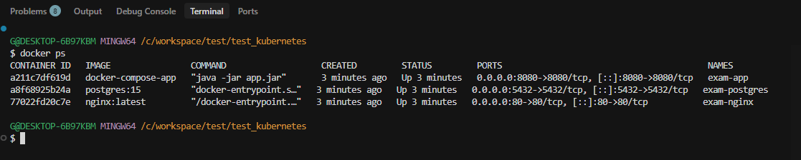
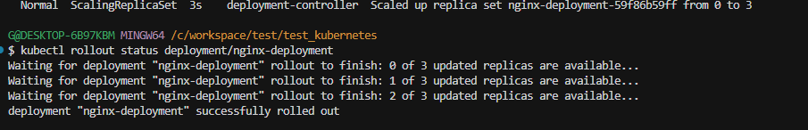

# Kubernetes 컨테이너 오케스트레이션 실습

Docker Compose 멀티 서비스 구성 및 Kubernetes Rolling Update 배포 실습 과제입니다.

---

## 실행 환경

- Docker & Docker Compose
- Kubernetes (kubectl, minikube 또는 클러스터 환경)
- Java 17 / Gradle

---

## 프로젝트 구조

```
k8s-exam/
├── docker-compose/
│   ├── docker-compose.yml       # 문항1: 멀티 서비스 구성
│   └── app/                     # Spring Boot 앱
│       ├── Dockerfile
│       ├── build.gradle
│       └── src/
├── k8s/
│   └── nginx-deployment.yaml    # 문항2: Rolling Update Deployment
└── screenshots/
    ├── docker-ps.png            # docker ps 결과
    └── rollout-status.png       # kubectl rollout status 결과
```

---

## 문항1: Docker Compose 실행 방법

### 서비스 구성

| 서비스   | 이미지       | 포트 | 역할                 |
| -------- | ------------ | ---- | -------------------- |
| postgres | postgres:15  | 5432 | 데이터베이스         |
| app      | (빌드)       | 8080 | Spring Boot API 서버 |
| nginx    | nginx:latest | 80   | 웹서버               |

> 3개 서비스 모두 `exam-network` (bridge)에 배치되어 컨테이너 이름으로 상호 통신합니다.

### 실행

```bash
# 1. Spring Boot 빌드
cd docker-compose/app
./gradlew bootJar

# 2. 전체 서비스 실행
cd ..
docker-compose up -d

# 3. 실행 결과 확인
docker ps
```

### 실행 결과



> 3개 컨테이너(exam-postgres, exam-app, exam-nginx) 모두 `Up` 상태 확인

---

## 문항2: Kubernetes Deployment 실행 방법

### Deployment 구성

| 항목           | 값            |
| -------------- | ------------- |
| 이미지         | nginx:latest  |
| replicas       | 3             |
| 전략           | RollingUpdate |
| maxSurge       | 1             |
| maxUnavailable | 0             |

> `maxSurge: 1` — 업데이트 중 최대 1개 Pod 추가 허용  
> `maxUnavailable: 0` — 업데이트 중 항상 3개 Pod 유지 (무중단 배포)

### 실행

```bash
# Deployment 적용
kubectl apply -f k8s/nginx-deployment.yaml

# 배포 완료 확인
kubectl rollout status deployment/nginx-deployment

# Pod 상태 확인
kubectl get pods
```

### 실행 결과



> `deployment "nginx-deployment" successfully rolled out` 출력 확인

---

## 설계 결정 사항

### 네트워크 구성

Spring Boot 앱이 PostgreSQL에 연결할 때 호스트명으로 `postgres`(컨테이너 이름)를 사용합니다. Docker Compose는 동일 네트워크 내 컨테이너를 서비스 이름으로 DNS 해석하므로 별도 IP 설정 없이 연결됩니다.

### Rolling Update 파라미터

`maxUnavailable: 0`으로 설정하여 배포 중에도 항상 3개의 Pod이 서비스 가능한 상태를 유지합니다. `maxSurge: 1`로 한 번에 1개씩 순차 교체하여 안전한 무중단 배포를 구현합니다.

### Spring Boot 최소 구성

시험 범위가 Docker/Kubernetes이므로 Spring Boot는 `/health` 엔드포인트 하나만 구현하고, PostgreSQL 연결은 환경변수(`${SPRING_DATASOURCE_URL}`)로 주입받아 docker-compose.yml에서 제어합니다.
